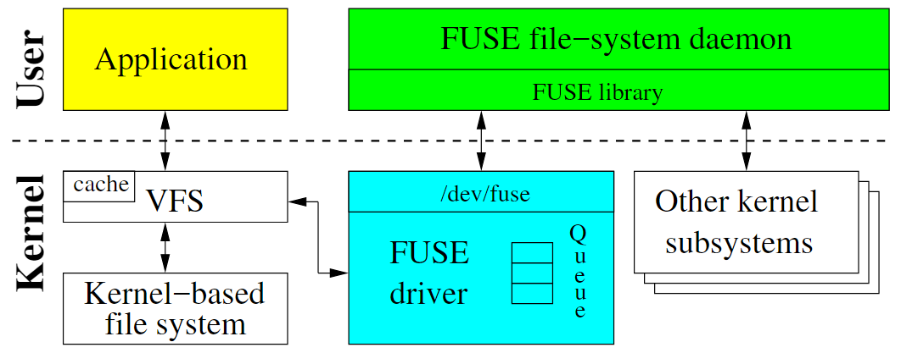
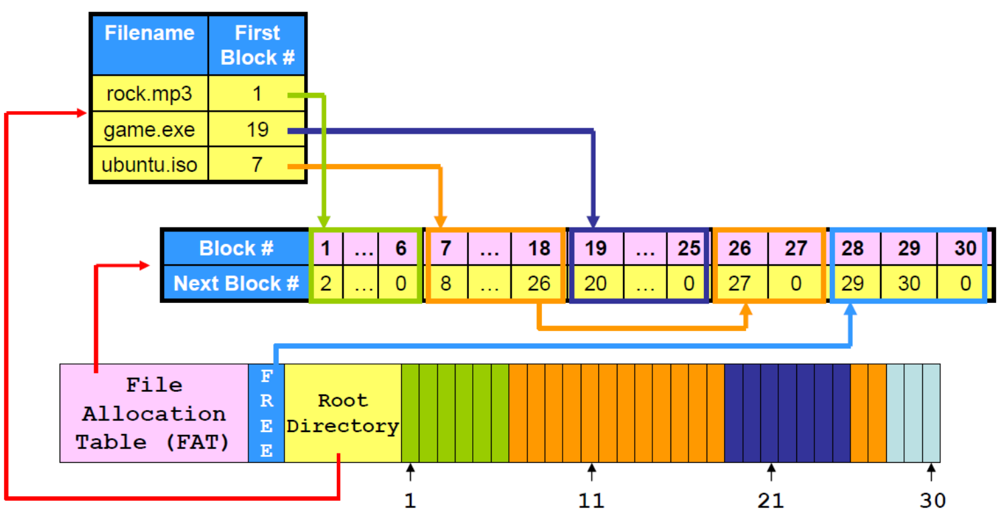
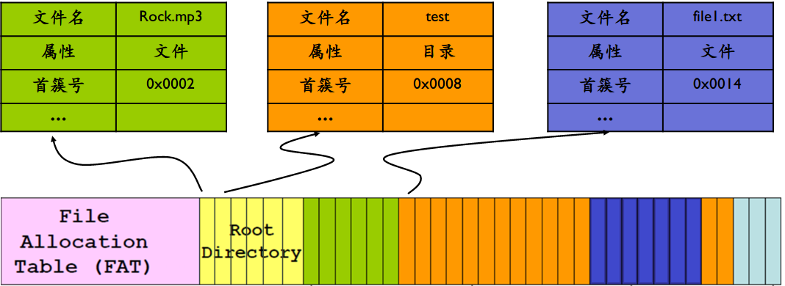

# 实验四   FAT文件系统的实现

## 实验目标

* 熟悉FAT16的存储结构，利用FUSE实现一个FAT文件系统

## 实验环境

* OS：Ubuntu 18.04 
### 背景知识：熟悉FUSE的使用

####  FUSE概述

* FUSE（Filesystem in Userspace，用户态文件系统）是一个实现在用户空间的文件系统框架，通过FUSE内核模块的支持，使用者只需要根据fuse提供的接口实现具体的文件操作就可以实现一个文件系统。 
* FUSE主要由三部分组成：FUSE内核模块、用户空间库libfuse以及挂载工具fusermount：

  1. fuse内核模块：实现了和VFS的对接，实现了一个能被用户空间进程打开的设备。
  2. fuse库libfuse：负责和内核空间通信，接收来自/dev/fuse的请求，并将其转化为一系列的函数调用，将结果写回到/dev/fuse；提供的函数可以对fuse文件系统进行挂载卸载、从linux内核读取请求以及发送响应到内核。
  3. 挂载工具：实现对用户态文件系统的挂载。
* 更多详细内容可参考[这个文章](https://zhuanlan.zhihu.com/p/143256077)。

#### 配置FUSE环境

- linux kernel在2.6.14后添加了FUSE模块，因此对于目前的大多数发行版来说只需要安装libfuse库即可。

- 在<https://github.com/libfuse/libfuse>里下载libfuse 2.9.5，然后编译安装： 

  ```shell
  $ sudo apt install pkg-config pkgconf
  $ wget -O libfuze-2.9.5.zip https://codeload.github.com/libfuse/libfuse/zip/fuse_2_9_5
  unzip libfuze-2.9.5.zip
  $ cd libfuse-fuse_2_9_5/
  $ ./makeconf.sh
  $ ./configure --prefix=/usr
  $ make -j4
  $ sudo make install
  ```

- **编译出错处理：**在执行./makeconf.sh可能会遇到“ libtoolize: not found ”或 “autoreconf: not found”，需要安装libtool和autoconf软件包，ubuntu下可以通过下面的命令安装：

  ```shell
  sudo apt install libtool
  sudo apt install autoconf
  ```


####  测试FUSE

- 通过libfuse-fuse_2_9_5/example下的fusexmp进行测试：

  ```
  cd example
  mkdir fuse_test_dir
  ./fusexmp -d fuse_test_dir
  ```

- 这时候在文件管理器中打开fuse_test_dir目录，可以看到当前Linux系统的“/”被挂载到这个目录下。

- 结束测试可以直接在当前终端中Ctrl + C结束程序，或者在新的终端中输入：

  ```shell
  fusermount -u fuse_test_dir
  ```

- **提示：**当执行用户自己实现的fuse程序时，如果出现下图的错误（"fuse: bad mount point"），可通过执行上面这条命令卸载对应的文件夹来解决。

  


## 任务一：实现FAT文件系统读操作
### FAT文件系统初识
FAT(File Allocation Table)是“文件分配表”的意思。顾名思义，就是用来记录文件所在位置的表格，它对于硬盘的使用是非常重要的，假若丢失文件分配表，那么硬盘上的数据就会因无法定位而不能使用了。不同的操作系统所使用的文件系统不尽相同，在个人计算机上常用的操作系统中，MS-DOS 6.x及以下版本使用FAT16。操作系统根据表现整个磁盘空间所需要的簇数量来确定使用多大的FAT。所谓簇就是磁盘空间的配置单位，就象图书馆内一格一格的书架一样。FAT16使用了16位的空间来表示每个扇区(Sector)配置文件的情形，故称之为FAT16。
从上述描述中我们够得知，一个FAT分区或者磁盘能够使用的簇数是2^16=65536个，因此簇大小是一个变化值，通常与分区大小有关，计算方式为：(磁盘大小/簇个数)向上按2的幂取整。在FAT16文件系统中，由于兼容性等原因，簇大小通常不超过32K，这也是FAT分区容量不能超过2GB的原因。
### 专有名词
|  名词  | 释义  |
|  ----  | ----  |
| 簇  | 文件的最小空间分配单元，通常为若干个扇区，每个文件最小将占用一个簇 |
| 扇区  |磁盘上的磁道被等分为若干个弧段，这些弧段被称为扇区，硬盘的读写以扇区为基本单位|

### 磁盘分布
<table >
    <tr align="center">
        <td colspan="8">一个FAT分区或磁盘的结构布局</td>
    </tr>
    <tr align="center">
        <td>内容</td>
        <td>主引导区</td>
        <td>文件系统信息扇区</td>
        <td>额外的保留空间</td>
        <td>文件分配表1(FAT表1)</td>
        <td>文件分配表2(FAT表2)</td>
        <td>根目录(Root directory)</td>
        <td>数据区()</td>
    </tr>
    <tr align="center">
        <td>大小(Bytes)</td>
        <td colspan="3">保留扇区数*扇区大小</td>
        <td>FAT扇区数* 扇区大小</td>
        <td>FAT扇区数* 扇区大小</td>
        <td>根目录条目数*文件条目大小</td>
        <td>剩下的磁盘空间</td>
    </tr>
</table>

一个FAT文件系统包括四个不同的部分。

* **保留扇区**，位于最开始的位置。 第一个保留扇区是引导扇区（分区启动记录）。它包括一个称为基本输入输出参数块的区域（包括一些基本的文件系统信息尤其是它的类型和其它指向其它扇区的指针），通常包括操作系统的启动调用代码。保留扇区的总数记录在引导扇区中的一个参数中。引导扇区中的重要信息可以被DOS和OS/2中称为驱动器参数块的操作系统结构访问。
* **FAT区域**。它包含有两份文件分配表，这是出于系统冗余考虑，尽管它很少使用。它是分区信息的映射表，指示簇是如何存储的。
* **根目录区域**。它是在根目录中存储文件和目录信息的目录表。在FAT32下它可以存在分区中的任何位置，但是在FAT16中它永远紧随FAT区域之后。
* **数据区域**。这是实际的文件和目录数据存储的区域，它占据了分区的绝大部分。通过简单地在FAT中添加文件链接的个数可以任意增加文件大小和子目录个数（只要有空簇存在）。然而需要注意的是每个簇只能被一个文件占有：如果在32KB大小的簇中有一个1KB大小的文件，那么31KB的空间就浪费掉了。
#### 启动扇区详解
|名称|偏移(字节) |长度(字节)|说明|
|--             |--     |:--: |--|
|BS_jmpBoot     |0x00	|3	|跳转指令（跳过开头一段区域）|
|BS_OEMName     |0x03	|8	|OEM名称，Windows操作系统没有针对这个字段做特殊的逻辑，理论上说这个字段只是一个标识字符串，但是有一些FAT驱动程序可能依赖这个字段的指定值。常见值是"MSWIN4.1"和"FrLdr1.0"|
|<b>BPB_BytsPerSec |0x0b	|2	|<b>每个扇区的字节数。基本输入输出系统参数块从这里开始。|
|<b>BPB_SecPerClus |0x0d	|1	|<b>每簇扇区数|
|<b>BPB_RsvdSecCnt |0x0e	|2	|<b>保留扇区数（包括主引导区）|
|<b>BPB_NumFATS    |0x10	|1	|<b>文件分配表数目，FAT16文件系统中为0x02,FAT2作为FAT1的冗余|
|<b>BPB_RootEntCnt |0x11	|2	|<b>最大根目录条目个数|
|BPB_TotSec16   |0x13	|2	|总扇区数（如果是0，就使用偏移0x20处的4字节值）|
|BPB_Media      |0x15	|1	|介质描述：F8表示为硬盘，F0表示为软盘|
|<b>BPB_FATSz16 |0x16	|2	|<b>每个文件分配表的扇区数（FAT16专用）|
|BPB_SecPerTrk  |0x18	|2	|每磁道的扇区数|
|BPB_NumHeads   |0x1a	|2	|磁头数|
|BPB_HiddSec    |0x1c	|4	|隐藏扇区数|
|BPB_TotSec32   |0x20	|4	|总扇区数（如果0x13处不为0，则该处应为0）|
|BS_DrvNum      |0x24	|1	|物理驱动器号，指定系统从哪里引导。|
|BS_Reserved1   |0x25	|1	|保留字段。这个字段设计时被用来指定引导扇区所在的|
|BS_BootSig     |0x26	|1	|扩展引导标记（Extended Boot Signature）|
|BS_VollID      |0x27	|4	|卷序列号，例如0|
|BS_VollLab     |0x2B	|11	|卷标，例如"NO NAME "|
|BS_FilSysType  |0x36   |8  |文件系统类型，例如"FAT16"|
|Reserved2      |0x3E   |448|引导程序|
|Signature_word |0x01FE  |2  |引导区结束标记|
根据上面的DBR扇区，我们可以算出各FAT的偏移地址，根目录的偏移地址，数据区的偏移地址。

FAT1偏移地址：保留扇区之后就是FAT1。因此可以得到，FAT1的偏移地址就是`BPB_RsvdSecCnt`*`BPB_BytsPerSec`

根目录偏移地址： FAT1表后两个FAT表地址就是根目录区，即FAT1偏移地址+`BPB_NumFATS`\*`BPB_FATSz16`\*`BPB_BytsPerSec`。

数据区的偏移地址：根目录偏移地址+根目录大小，即根目录偏移地址+`BPB_RootEntCnt`*32


### FAT文件系统磁盘分布详解

在FAT文件系统中，文件分为两个部分，第一个部分为目录项，记录该文件的文件名，拓展名，以及属性，首簇号等元数据信息，注：文件夹也是一种文件，它的目录项和普通文件结构相同；第二部分为实际存储内容，若为文件，则存储文件内容，若为文件夹，则存储子文件夹的文件目录项。
* 例一，文件处于Root目录下 (假设该文件路径为/rock.mp3)
若文件处于Root目录下，那么该文件的目录项将会存储在`Root Directory`区域中，其中记录了该文件的文件名，拓展名，以及第一个文件簇的地址。
FAT Table中存储了所有可用的簇，通过簇地址查找使用情况，我们能够得知该文件的下一个簇地址，若下一个簇地址为END标记符，则表示该簇为最后一个簇。通过查询FAT Table，我们能够得知该文件所有簇号。
* 情况二，文件处于Root目录下子文件夹中 (假设该文件路径为/test/file1.txt)，那么可知test目录项在`Root Directory`中，而rock.mp3的目录项将会存储在test文件的数据区域。


#### 文件目录项是如何存储的
文件目录是文件的元数据信息，存储在`Root directory`以及数据区中，下图是两个文件/rock.mp3和 /test/file1.txt的文件目录项存储示例。


**文件的目录项结构**
|名称               |偏移(字节) |长度(字节)|说明|
|--                 |--     |:--: |--|
|<b>DIR_Name           |0x00   |11     |<b>文件名（前8个字节为文件名，后3个为拓展名）
|<b>DIR_Attr           |0x0B   |1      |<b>文件属性，取值为0x10表示为目录，0x20表示为文件
|DIR_NTRes          |0x0C   |1      |保留
|DIR_CrtTimeTenth   |0x0D   |1      |保留(FAT32中用作创建时间，精确到10ms))
|DIR_CrtTime        |0x0E   |2      |保留(FAT32中用作创建时间，精确到2s)
|DIR_CrtDate        |0x10   |2      |保留(FAT32中用作创建日期)
|DIR_LstAccDate     |0x12   |2      |保留(FAT32中用作最近访问日期）
|DIR_FstClusHI      |0x14   |2      |保留(FAT32用作第一个簇的两个高字节)
|DIR_WrtTime        |0x16   |2      |文件最近修改时间|
|DIR_WrtDate        |0x18   |2      |文件最近修改日期|
|<b>DIR_FstClusLO      |0x1A   |2      |<b>文件首簇号(FAT32用作第一个簇的两个低字节)|
|<b>DIR_FileSize       |0x1C   |4      |<b>文件大小|
#### 文件分配表(FAT表)详解
* FAT表由FAT表项构成的，我们把FAT表项简称为FAT项，本次实验中，FAT项为`2`个字节大小。每个FAT项的大小有12位，16位，32位，三种情况，对应的分别FAT12，FAT16，FAT32文件系统。

* 每个FAT项都有一个固定的编号，这个编号是从0开始。

* FAT表的前两个FAT项有专门的用途：0号FAT项通常用来存放分区所在的介质类型，例如硬盘的介质类型为“F8”，那么硬盘上分区FAT表第一个FAT项就是以"F8"开始，1号FAT项则用来存储文件系统的肮脏标志，表明文件系统被非法卸载或者磁盘表面存在错误。

* 分区的数据区每一个簇都会映射到FAT表中的唯一一个FAT项。因为0号FAT项与1号FAT项已经被系统占用，无法与数据区的族形成映射，所以从2号FAT项开始跟数据区中的第一个簇映射，正因为如此，数据区中的第一个簇的编号为2，这也是没有0号簇与1号簇的原因，然后2号簇与3号FAT项映射，3号簇与4号FAT项映射
* 分区格式化后，用户文件以簇为单位存放在数据区中，一个文件至少占用一个簇。当一个文件占用多个簇时，这些族的簇号不一定是连续的，但这些簇号在存储该文件时就确定了顺序，即每一个文件都有其特定的“簇号链”。在分区上的每一个可用的簇在FAT中有且只有一个映射FAT项，通过在对应簇号的FAT项内填入“FAT项值”来表明数据区中的该簇是已占用，空闲或者是坏簇三种状态之一。

##### 取值意义
|簇取值		        |对应含义|
|--|--|
|0x0000		        |空闲簇|
|0x0001		        |保留簇|
|0x0002 - 0xFFEF	|被占用的簇；指向下一个簇|
|0xFFF0 - 0xFFF6    |保留值|
|0xFFF7             |坏簇|
|0xFFF8 - 0xFFFF	|文件最后一个簇|

### 完成simple fat16中关于读文件的部分
* 代补全部分：完成simple_fat16.c文件中TODO部分，主要包括以下功能
    1. path_split 将输入路径按“/”分割成多个字符串，并按照FAT文件名格式转换字符串
    2. path_decode 将FAT文件名格式解码成原始的文件名
    3. pre_init_fat16 读取启动扇区，获得文件系统相关参数，初始化fat16_ins的其余成员变量
    4. fat_entry_by_cluster 返回簇号为ClusterN对应的FAT表项
    5. find_root 在Root directory中查找path对应的文件或目录，若找到的为path的中间目录，则调用find_subdir继续寻找
    6. find_subdir 从子目录开始查找path对应的文件或目录
    7. fat16_readdir 遍历给定目录下的所有文件名，返回给fuse
    8. fat16_read 从给定文件中读取一定长度的数据，返回给fuse


- 代码调试
  
  请在main函数中的指定位置编写调试相关代码(如对上面的补充好了的函数进行调用, 并观察其返回的结果符不符合你的预期). 可以使用

  ```shell
  #进入源码目录
  make clean
  make
  ./simple_fat16 --debug
  ```
  执行调试部分的代码. 


- 使用如下的命令编译并测试程序：

  ```shell
  #进入源码目录
  make clean
  make
  #测试一
  ./simple_fat16 --test
  ```

  测试一是为了验证程序的FAT相关部分的代码正确性（以fat16_test.img作为磁盘镜像文件），一共有6个测试目标：

  

  通过测试一后，运行如下的命令进行FUSE功能的测试（以fat16.img作为磁盘镜像文件）：

  ```shell
  #测试二
  ./simple_fat16 -d fat_dir
  ```

  这时候在文件管理器中打开fat_dir目录，需要能够看到里面的文件列表，以及正常访问里面的文件：


##### 回答问题

* 简要描述代码定义的结构体fat16_oper中每个元素所对应的操作和操作执行的流程
* 阅读libfuse源码，试解释本实验中使用到的fuse_main()函数，要求至少追踪到fuse_session_loop()函数的调用并解释出此函数执行的内容。

### 
## 参考资料
* [FAT文件系统实现](https://github.com/eerimoq/simba/blob/master/src/filesystems/fat16.c)
* [文件分配表](https://zh.wikipedia.org/wiki/%E6%AA%94%E6%A1%88%E9%85%8D%E7%BD%AE%E8%A1%A8)
* [fat32文件系统示例](https://liuyehcf.github.io/2017/09/25/%E6%93%8D%E4%BD%9C%E7%B3%BB%E7%BB%9F%E5%8E%9F%E7%90%86-%E6%96%87%E4%BB%B6%E7%B3%BB%E7%BB%9F2/)
## 实验时间安排

注：此处为实验发布时的安排计划，请以课程主页和课程群内最新公告为准

- 6.4  晚实验课，讲解及检查实验
- 6.11晚实验课，检查实验
- 6.18晚实验课，检查实验